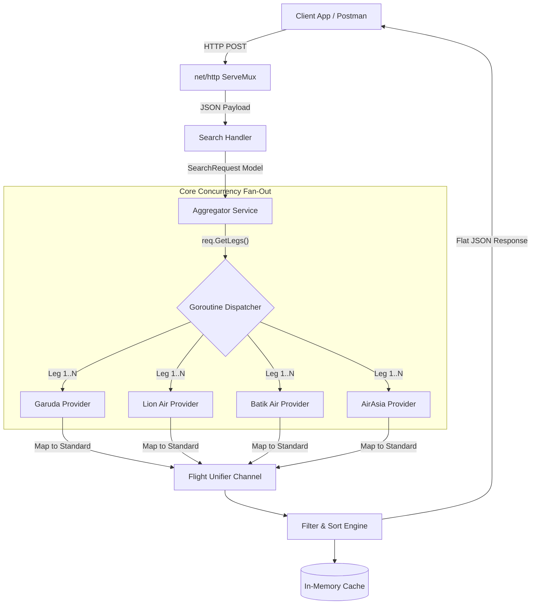
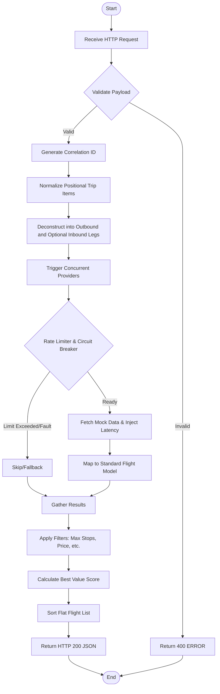
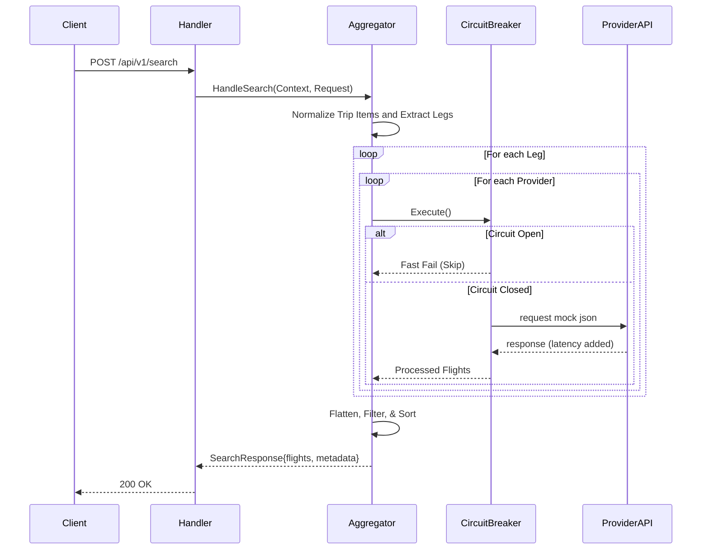
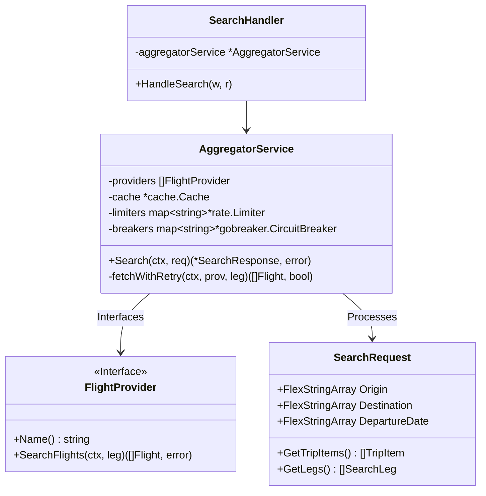
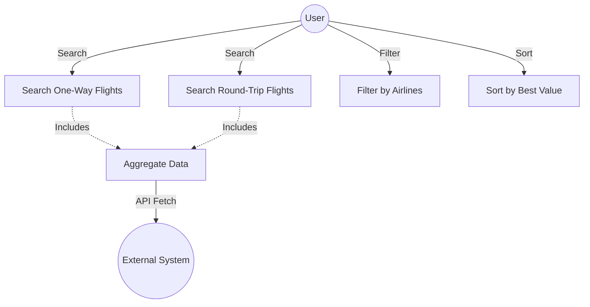

# Heimdall Travel Service - Flight Search & Aggregation System

A concurrent Go service that aggregates flight data from multiple simulated airline APIs, sanitizes and merges the payloads, runs filtering and dynamic sorting rules, and serves them instantly via an in-memory cache. 

This repository successfully implements the core requirements and handles production-ready phenomena like provider API failures, latency fluctuations, missing fields, and timezone disparities.

---

## 1. Setup & Run Instructions

### Prerequisites
* **Go 1.22+** (Developed and tested strictly on Go 1.26.1). No external containers (like Docker or Redis) are required since caching is handled purely in-memory.

### Installation

1. Clone or navigate to the repository folder: 
   ```bash
   git clone https://github.com/pandusatrianura/heimdall-travel-service.git
   cd heimdall-travel-service
   ```
2. Ensure Go modules are tidy:
   ```bash
   go mod tidy
   ```
3. Initialize the environment:
   ```bash
   cp .env.example .env
   ```
4. **Configure your settings**: Edit `.env` to tune your search algorithm (timeouts, ranking weights, etc.).
5. **Install k6 (Optional)**: If you plan to run advanced load tests, follow the [k6 Installation Guide](#5-advanced-performance-testing-k6).

### Running the Server
The application initializes relative mock data streams from the root directory. Start the server from the project's root:

```bash
go run ./cmd/server/main.go
```
*The service will start on port `8008` (default). You can change this in your `.env` file.*

### Environment Configurations (.env)
The system is fully tunable without code changes via the following environment variables:

| Key | Default Value | Description |
| :--- | :--- | :--- |
| `PORT` | `8008` | The HTTP port the service will listen on. |
| `MOCK_DATA_PATH` | `mock_provider` | Directory containing the mock airline response JSON files. |
| `MOCK_DATA_PROVIDER` | `[...]` | JSON list of filenames used for mock responses across all providers. |
| `CACHE_TTL_MINUTES` | `5` | Duration in minutes that search results remain in the memory cache. |
| `CACHE_CLEANUP_MINUTES` | `10` | Interval in minutes for the background process to purge expired cache entries. |
| `PROVIDER_TIMEOUT_MS` | `1500` | Maximum time to wait for a provider response before timing out. |
| `BEST_VALUE_PRICE_WEIGHT` | `0.6` | Weight (0 to 1.0) applied to price in the "Best Value" ranking algorithm. |
| `BEST_VALUE_DURATION_WEIGHT` | `0.4` | Weight (0 to 1.0) applied to flight duration in the ranking algorithm. |
| `AIRASIA_DELAY_MS` | `100` | Simulated network delay (latency) for the AirAsia provider. |
| `AIRASIA_FAILURE_RATE` | `10` | Probability (0-100) of a simulated failure for the AirAsia provider. |
| `BATIK_AIR_DELAY_MS` | `200` | Simulated network delay (latency) for the Batik Air provider. |
| `GARUDA_INDONESIA_DELAY_MS` | `50` | Simulated network delay (latency) for the Garuda Indonesia provider. |
| `LION_AIR_DELAY_MS` | `150` | Simulated network delay (latency) for the Lion Air provider. |


### Deployment & VPS (Docker)
If you are deploying to a VPS, use the included Docker Compose for an instant production-ready setup:

```bash
docker-compose up -d --build
```
This multi-stage build creates a minimal Alpine image (~20MB) and automatically maps your host ports and `.env` settings.

* `make check` - Full local CI suite (Linter, Security, and Unit Tests).
* `make test` - Runs unit tests with `-race` and `-cover`.
* `make docs-serve` - Serve the OpenAPI spec and local API docs viewers from the `docs/` folder.
* **Load & Stress Testing** - Measure throughput and latency percentiles:
  ```bash
  chmod +x ./scripts/stress_test.sh && ./scripts/stress_test.sh http://localhost:8008 10 100
  ```

### API Documentation
The formal API contract is available in [docs/openapi.yaml](/Users/pandusatrianurananda/Works/Space/go/src/github.com/pandusatrianura/heimdall-travel-service/docs/openapi.yaml).

For a browsable local viewer, serve the `docs/` directory and open one of these pages:

```bash
make docs-serve
```

Then open:
- Swagger UI: [docs/swagger-ui.html](/Users/pandusatrianurananda/Works/Space/go/src/github.com/pandusatrianura/heimdall-travel-service/docs/swagger-ui.html)
- Redoc: [docs/redoc.html](/Users/pandusatrianurananda/Works/Space/go/src/github.com/pandusatrianura/heimdall-travel-service/docs/redoc.html)

When served locally, the pages are available at:
- `http://localhost:8081/swagger-ui.html`
- `http://localhost:8081/redoc.html`

---

## 2. API Usage Examples (curl)

### One-Way Search
```bash
curl -X POST http://localhost:8008/api/v1/search \
     -H "Content-Type: application/json" \
     -d '{
       "origins": "CGK",
       "destinations": "DPS",
       "departureDate": "2025-12-15",
       "returnDate": null,
       "passengers": 1,
       "cabinClass": "economy"
     }'
```

### Round-Trip Search
The outbound and inbound legs are paired from the same trip item:
```bash
curl -X POST http://localhost:8008/api/v1/search \
     -H "Content-Type: application/json" \
     -d '{
       "origins": "CGK",
       "destinations": "DPS",
       "departureDate": "2025-12-15",
       "returnDate": "2025-12-18",
       "passengers": 1,
       "cabinClass": "economy"
     }'
```

### Multi-Trip Search (Positional Pairing)
Each array index represents one independent trip item. The service does **not** build a Cartesian product.
```bash
# Trip 0: CGK -> DPS, depart 2025-12-15, return 2025-12-25
# Trip 1: SUB -> SIN, depart 2025-12-20, return 2025-12-26
curl -X POST http://localhost:8008/api/v1/search \
     -H "Content-Type: application/json" \
     -d '{
       "origins": ["CGK", "SUB"],
       "destinations": ["DPS", "SIN"],
       "departureDate": ["2025-12-15", "2025-12-20"],
       "returnDate": ["2025-12-25", "2025-12-26"]
     }'
```

### Mixed One-Way and Round-Trip Search
`returnDate` can be omitted per item by using `null` or an empty string in that position.
```bash
# Trip 0: one-way CGK -> DPS on 2025-12-15
# Trip 1: round-trip SUB -> SIN on 2025-12-20, return 2025-12-26
curl -X POST http://localhost:8008/api/v1/search \
     -H "Content-Type: application/json" \
     -d '{
       "origins": ["CGK", "SUB"],
       "destinations": ["DPS", "SIN"],
       "departureDate": ["2025-12-15", "2025-12-20"],
       "returnDate": [null, "2025-12-26"],
       "passengers": 1,
       "cabinClass": "economy"
     }'
```

### Response Shape
The API returns a flat `flights` list.

For a single trip item, `search_criteria.origin`, `destination`, and `departure_date` are serialized as scalar strings, matching the original response shape. For positional multi-trip requests, those same fields are echoed as arrays so each index still maps back to the requested trip item.

```json
{
  "search_criteria": {
    "origin": "CGK",
    "destination": "DPS",
    "departure_date": "2025-12-15",
    "passengers": 1,
    "cabin_class": "economy"
  },
  "metadata": {
    "total_results": 1,
    "providers_queried": 4,
    "providers_succeeded": 4,
    "providers_failed": 0,
    "search_time_ms": 150,
    "cache_hit": false
  },
  "flights": [
    {
      "id": "QZ7250_AirAsia",
      "provider": "AirAsia",
      "airline": {
        "name": "AirAsia",
        "code": "QZ"
      },
      "flight_number": "QZ7250",
      "departure": {
        "airport": "CGK",
        "city": "Jakarta",
        "datetime": "2025-12-15T15:15:00+07:00",
        "timestamp": 1734246900
      },
      "arrival": {
        "airport": "DPS",
        "city": "Denpasar",
        "datetime": "2025-12-15T20:35:00+08:00",
        "timestamp": 1734267300
      },
      "duration": {
        "total_minutes": 260,
        "formatted": "4h 20m"
      },
      "stops": 1,
      "price": {
        "amount": 485000,
        "currency": "IDR"
      },
      "available_seats": 88,
      "cabin_class": "economy",
      "aircraft": null,
      "amenities": [],
      "baggage": {
        "carry_on": "Cabin baggage only",
        "checked": "Additional fee"
      }
    }
  ]
}
```

This example is intentionally aligned with [mock_provider/expected_result.json](/Users/pandusatrianurananda/Works/Space/go/src/github.com/pandusatrianura/heimdall-travel-service/mock_provider/expected_result.json). For positional multi-trip requests, `search_criteria` is echoed as arrays and `flights[]` remains flat.

*Identity routes (for example `CGK -> CGK`) are rejected with `400 Bad Request`.*

---

## 3. Core Requirement Mapping & Validation

This section demonstrates how the Heimdall Travel Service fulfills every core requirement through specific API capabilities.

### 1. Aggregate Flight Data from Multiple Sources
**Requirement**: Fetch and normalize data from multiple airline/provider APIs.
**Validation**:
```bash
# Demonstrates aggregation from Garuda, Lion, Batik, and AirAsia
# Returns normalized UTC timestamps and accurate IDR formatting
curl -X POST http://localhost:8008/api/v1/search \
     -H "Content-Type: application/json" \
     -d '{
       "origins": "CGK",
       "destinations": "DPS",
       "departureDate": "2025-12-15"
     }'
```

### 2. Search & Filter Capabilities
**Requirement**: Search by route/date and filter by price, stops, airlines, and duration.
**Validation**:
```bash
# Filter: Under 3M IDR, Direct flights only, specific airlines, sorted by duration
curl -X POST http://localhost:8008/api/v1/search \
     -H "Content-Type: application/json" \
     -d '{
       "origins": "CGK",
       "destinations": "DPS",
       "departureDate": "2025-12-15",
       "max_price": 3000000,
       "max_stops": 0,
       "airlines": ["Garuda Indonesia", "Batik Air"],
       "sort_by": "duration_shortest"
     }'
```

### 3. Price Comparison & Ranking
**Requirement**: Compare prices, calculate total duration, and rank by "best value".
**Validation**:
```bash
# Ranking based on "Best Value" (mathematical mix of price and speed)
curl -X POST http://localhost:8008/api/v1/search \
     -H "Content-Type: application/json" \
     -d '{
       "origins": "CGK",
       "destinations": "DPS",
       "departureDate": "2025-12-15",
       "sort_by": "best_value"
     }'
```

### 4. Handle Data Inconsistencies
**Requirement**: Handle time zones, missing fields, and validate flight data chronology.
**Validation**:
```bash
# Triggering validation: each positional item must have aligned arrays and returnDate cannot be earlier than departureDate
curl -X POST http://localhost:8008/api/v1/search \
     -H "Content-Type: application/json" \
     -d '{
       "origins": ["CGK", "SUB"],
       "destinations": ["DPS", "SIN"],
       "departureDate": ["2025-12-15", "2025-12-20"],
       "returnDate": ["2025-12-10", "2025-12-26"]
     }'
```
*Note: The timeutil package internally normalizes mixed provider formats (ISO-8601, RFC-1123) into UTC Unix timestamps.*

---

## 4. API Performance & Complexity

### Algorithm Complexity (Positional Trip Expansion)
The aggregator now uses **positional trip expansion**. Each index in `origins`, `destinations`, `departureDate`, and optional `returnDate` represents one trip item. This makes the request contract deterministic: the server expands exactly the trips the client specified, instead of generating a Cartesian product.

At the implementation level:

- **Trip Items**: $Trips = N$
- **Outbound Legs**: $Legs_{out} = N$
- **Inbound Legs**: $Legs_{in} = R$
- **Total Legs**: $Legs_{total} = N + R$
- **Provider Fan-Out**: $Requests_{upstream} = (N + R) \times P$

Where $R$ is the number of trip items that include a non-empty `returnDate`.

For a high-level summary, the request fan-out now behaves like **$O(N \cdot P)$** because each trip item produces at most two legs.

> [!NOTE]
> **Where**:
> - **N**: Number of positional **Trip Items** provided in the request.
> - **R**: Number of trip items with a non-empty `returnDate`.
> - **P**: Number of active **Upstream Providers** (Airline APIs) configured.

> [!IMPORTANT]
> This implementation performs **positional multi-trip expansion**, not a connected itinerary builder. It generates only the legs specified by each trip item, then queries every provider for those legs. It does **not** currently stitch `CGK -> DPS -> SIN` into a single composite itinerary object.

#### Why Choose Positional Expansion Instead of Matrix Search?

1. **Deterministic routing**: The payload directly maps to the routes the client asked for, with no hidden Cartesian expansion.
2. **Natural support for one-way and round-trip in one request**: Each item may or may not have a `returnDate`.
3. **Multi-trip without ambiguity**: `origins[1]`, `destinations[1]`, and `departureDate[1]` always belong to the same trip item.
4. **Less unnecessary provider work**: The service queries only requested legs, so fan-out is smaller than the old matrix mode.
5. **Natural fit for concurrency**: Each generated `leg x provider` request is still independent, so scatter-gather remains efficient.

#### Worked Calculation Samples

**Sample 1: Simple One-Way Search**

- Inputs: 1 trip item, no return date, 4 providers
- Outbound legs: $1$
- Inbound legs: $0$
- Total legs: $1$
- Upstream requests: $1 \times 4 = 4$

Sample payload:

```json
{
  "origins": "CGK",
  "destinations": "DPS",
  "departureDate": "2025-12-15",
  "returnDate": null,
  "passengers": 1,
  "cabinClass": "economy"
}
```

**Sample 2: Round-Trip Search**

- Inputs: 1 trip item, 1 return date, 4 providers
- Outbound legs: $1$
- Inbound legs: $1$
- Total legs: $1 + 1 = 2$
- Upstream requests: $2 \times 4 = 8$

Sample payload:

```json
{
  "origins": "CGK",
  "destinations": "DPS",
  "departureDate": "2025-12-15",
  "returnDate": "2025-12-18",
  "passengers": 1,
  "cabinClass": "economy"
}
```

**Sample 3: Positional Multi-Trip Search**

- Inputs: 2 trip items, both round-trip, 4 providers
- Outbound legs: $2$
- Inbound legs: $2$
- Total legs: $2 + 2 = 4$
- Upstream requests: $4 \times 4 = 16$

Sample payload:

```json
{
  "origins": ["CGK", "SUB"],
  "destinations": ["DPS", "SIN"],
  "departureDate": ["2025-12-15", "2025-12-20"],
  "returnDate": ["2025-12-25", "2025-12-26"],
  "passengers": 1,
  "cabinClass": "economy"
}
```

This is the exact reasoning behind the example below:

- **Example**: Searching **2 positional trip items** across **4 providers** triggers $4 \text{ legs} \cdot 4 \text{ providers} = \mathbf{16}$ concurrent upstream requests when both items are round-trip.

**Sample 4: Mixed One-Way and Round-Trip Search**

- Inputs: 2 trip items, only the second item has `returnDate`, 4 providers
- Outbound legs: $2$
- Inbound legs: $1$
- Total legs: $3$
- Upstream requests: $3 \times 4 = 12$

Sample payload:

```json
{
  "origins": ["CGK", "SUB"],
  "destinations": ["DPS", "SIN"],
  "departureDate": ["2025-12-15", "2025-12-20"],
  "returnDate": [null, "2025-12-26"],
  "passengers": 1,
  "cabinClass": "economy"
}
```

**Sample 5: Identity Route Validation**

- Inputs: `origins = ["CGK"]`, `destinations = ["CGK"]`, `departureDate = ["2025-12-15"]`
- Result: `400 Bad Request`
- Reason: the implementation rejects trip items where origin and destination are equal.

Sample payload:

```json
{
  "origins": ["CGK"],
  "destinations": ["CGK"],
  "departureDate": ["2025-12-15"],
  "passengers": 1,
  "cabinClass": "economy"
}
```

### High-Concurrency Scatter-Gather
- **Network Bound**: Due to parallel Goroutine fan-out, the wall-clock time is governed by $O(\max(T_{provider}))$, effectively the latency of the slowest provider responding.
- **Processing Bound**: $O(F \log F)$ for sorting and unifying $F$ total flight results.
- **Resource Management**: The system uses `sync.WaitGroup` and buffered result channels to prevent memory leaks during massive fan-out events.

### Throughput & Scaling
The system uses the `golang.org/x/time/rate` token-bucket limiter to safely bridge between high-concurrency requests and provider rate limits.
- **RPS Capability**: Limited primarily by memory (result volume) and the `PROVIDER_TIMEOUT_MS` setting.
- **Observability**: Every response includes a `metadata` block with `total_results`, `providers_queried`, and `search_time_ms` for performance monitoring.

### Fan-Out Reference Table

| Mode | Trip Items | Search Legs | Upstream Req |
| :--- | :--- | :--- | :--- |
| **One-Way** | 1 | 1 | 4 |
| **Round-Trip** | 1 | 2 | 8 |
| **Two Round-Trip Items** | 2 | 4 | 16 |
| **Mixed One-Way + Round-Trip** | 2 | 3 | 12 |

> [!TIP]
> **Scaling Strategy**: The high-concurrency fan-out now scales linearly with the number of trip items and whether each item includes a return leg, rather than multiplying every origin against every destination and date.

---

---

## 5. Explanation of Design Choices

### 1. Zero-Heavyweight Frameworks (Standard Library)
To demonstrate deep Go mastery, we use the pure `net/http` package. As of Go 1.22, the native `ServeMux` supports complex routing (e.g., `POST /api/v1/search`), providing a high-performance, dependency-free foundation that is easier to maintain than third-party wrappers like `Gin`.

### 2. Enterprise Circuit Breaker Pattern (`gobreaker`)
The aggregator uses a **Scatter-Gather pattern** via Goroutines and `sync.WaitGroup`. Beyond simple timeouts, we have integrated **Isolated Circuit Breakers** for every provider using the `sony/gobreaker` library. 
* **State Management**: If a provider fails 5 times consecutively, the circuit opens for **30 seconds**.
* **Resilience**: During this time, the system skips the failing provider entirely, protecting the aggregator from "hanging" on dead upstream services and ensuring lowest-possible latency for healthy providers.

### 3. Resilience & Exponential Backoff
Airlines like AirAsia are simulated with a 10% failure rate. Our system handles this gracefully using an internal retry loop with **Exponential Backoff** (50ms → 100ms → 200ms). This significantly improves reliability over unreliable network links while staying within the global request timeout.

### 4. Structured JSON Logging & Observability (`slog`)
We have replaced standard `log.Printf` with Go 1.21's **Structured JSON Logging**. 
* **Automated Correlation**: Every log record (from Handlers to Providers) automatically includes the **UUID v4 Correlation ID** via a custom context handler. 
* **Production Ready**: Logs are in machine-readable JSON format, ready to be ingested into ELK, Datadog, or Grafana Loki. This enables sub-second tracing of any search transaction across all internal layers.

### 5. Graceful Lifecycle Management
Unlike simple scripts, this service implements **Graceful Shutdown**. Upon receiving `SIGINT` or `SIGTERM`, it stops accepting new requests and waits up to **5 seconds** for in-flight searches to finish before closing. This prevents "502 Bad Gateway" errors during container restarts or deployments.

### 6. Tunable Ranking Algorithm ("Best Value")
The `best_value` sort isn't a hardcoded guess. It uses dynamic normalization:
1. It scans results for min/max price and duration boundaries.
2. It calculates a normalized score (0.0 to 1.0) for every flight.
3. It applies business weights (configurable via `.env`) to find the mathematical "Sweet Spot" between cost and speed.

`best_value` means:

- We do **not** automatically pick the cheapest flight.
- We also do **not** automatically pick the fastest flight.
- We try to pick the flight that gives the most reasonable trade-off between **price** and **travel time**.

So if one flight is very cheap but much slower, and another flight is very fast but much more expensive, the algorithm tries to find the middle ground.

#### How the Score Is Calculated

Inside one search result set, every flight gets two normalized numbers:

- **Normalized price**: how expensive this flight is compared to the cheapest and most expensive result in the same result set.
- **Normalized duration**: how long this flight is compared to the fastest and slowest result in the same result set.

The formula is:

$$
normalizedPrice = \frac{price - minPrice}{maxPrice - minPrice}
$$

$$
normalizedDuration = \frac{duration - minDuration}{maxDuration - minDuration}
$$

Then the final `best_value` score is:

$$
score = (wp \times normalizedPrice) + (wd \times normalizedDuration)
$$

where:

- `wp = BEST_VALUE_PRICE_WEIGHT`
- `wd = BEST_VALUE_DURATION_WEIGHT`

Concrete example from the current mock data:

- `QZ7250` from [mock_provider/expected_result.json](/Users/pandusatrianurananda/Works/Space/go/src/github.com/pandusatrianura/heimdall-travel-service/mock_provider/expected_result.json) has `price = 485000` and `duration = 260` minutes.
- `GA400` from [mock_provider/garuda_indonesia_search_response.json](/Users/pandusatrianurananda/Works/Space/go/src/github.com/pandusatrianura/heimdall-travel-service/mock_provider/garuda_indonesia_search_response.json) has `price = 1250000` and `duration = 110` minutes.
- `JT650` from [mock_provider/lion_air_search_response.json](/Users/pandusatrianurananda/Works/Space/go/src/github.com/pandusatrianura/heimdall-travel-service/mock_provider/lion_air_search_response.json) has `price = 780000` and `duration = 230` minutes.

If we rank those three flights together, the normalization inputs become:

- `price = 780000` for `JT650`
- `minPrice = 485000` from `QZ7250`
- `maxPrice = 1250000` from `GA400`
- `duration = 230` for `JT650`
- `minDuration = 110` from `GA400`
- `maxDuration = 260` from `QZ7250`

So the real calculation would be:

$$
normalizedPrice = \frac{780000 - 485000}{1250000 - 485000} = \frac{295000}{765000} \approx 0.386
$$

$$
normalizedDuration = \frac{230 - 110}{260 - 110} = \frac{120}{150} = 0.8
$$

$$
score = (0.6 \times 0.386) + (0.4 \times 0.8) \approx 0.552
$$

Important meaning:

- A **lower score is better**.
- Score `0.0` means "best possible inside this result set".
- Higher scores mean the flight is relatively more expensive, slower, or both.

#### What `BEST_VALUE_PRICE_WEIGHT=0.6` Means

`BEST_VALUE_PRICE_WEIGHT=0.6` means the final ranking gives **60% importance to price**.

This does **not** mean the system discounts the ticket price by 60%. It means price contributes a little more heavily than duration when calculating the final score.

#### What `BEST_VALUE_DURATION_WEIGHT=0.4` Means

`BEST_VALUE_DURATION_WEIGHT=0.4` means the final ranking gives **40% importance to duration**.

This means duration still matters, but it matters slightly less than price in the default configuration.

#### Why Choose `0.6` and `0.4`?

The default choice is a practical product heuristic:

- In most travel search scenarios, users are usually more sensitive to **price** than to a moderate time difference.
- But duration still matters enough that the algorithm should avoid promoting a very cheap but clearly inconvenient flight too aggressively.
- `0.6 / 0.4` keeps the ranking **price-led**, but not **price-only**.

So the intention is:

- **Price wins when the time difference is small**.
- **Duration can still win when the cheaper option is much slower**.

This is why the values sum to `1.0`: they behave like a simple weighting split between the two factors.

These numbers are **defaults**, not absolute truths. If your business wants to optimize for faster travel over cheaper fares, you can change them, for example:

- `0.8 / 0.2`: strongly price-focused
- `0.5 / 0.5`: balanced equally
- `0.3 / 0.7`: strongly duration-focused

#### Worked Example

Suppose one search returns these 3 flights:

| Flight | Price | Duration |
| :--- | :--- | :--- |
| A | Rp 1,000,000 | 90 min |
| B | Rp 1,200,000 | 100 min |
| C | Rp 1,500,000 | 120 min |

From these results:

- `minPrice = 1,000,000`
- `maxPrice = 1,500,000`
- `minDuration = 90`
- `maxDuration = 120`

Now normalize each flight.

**Flight A**

$$
normalizedPrice = \frac{1{,}000{,}000 - 1{,}000{,}000}{1{,}500{,}000 - 1{,}000{,}000} = 0.0
$$

$$
normalizedDuration = \frac{90 - 90}{120 - 90} = 0.0
$$

$$
score = (0.6 \times 0.0) + (0.4 \times 0.0) = 0.0
$$

**Flight B**

$$
normalizedPrice = \frac{1{,}200{,}000 - 1{,}000{,}000}{500{,}000} = 0.4
$$

$$
normalizedDuration = \frac{100 - 90}{30} \approx 0.33
$$

$$
score = (0.6 \times 0.4) + (0.4 \times 0.33) \approx 0.372
$$

**Flight C**

$$
normalizedPrice = \frac{1{,}500{,}000 - 1{,}000{,}000}{500{,}000} = 1.0
$$

$$
normalizedDuration = \frac{120 - 90}{30} = 1.0
$$

$$
score = (0.6 \times 1.0) + (0.4 \times 1.0) = 1.0
$$

Final ranking:

1. **Flight A** with score `0.0`
2. **Flight B** with score `0.372`
3. **Flight C** with score `1.0`

This is intuitive: Flight A is both cheapest and fastest, Flight C is both most expensive and slowest, and Flight B sits in the middle.

#### Another Example: When a Faster Flight Can Lose

Suppose there are only 2 flights:

| Flight | Price | Duration |
| :--- | :--- | :--- |
| X | Rp 900,000 | 120 min |
| Y | Rp 1,400,000 | 90 min |

Then:

- Flight X is cheapest but slower
- Flight Y is fastest but more expensive

Normalized scores become approximately:

- Flight X: `price = 0.0`, `duration = 1.0`
- Flight Y: `price = 1.0`, `duration = 0.0`

With the default weights:

$$
score_X = (0.6 \times 0.0) + (0.4 \times 1.0) = 0.4
$$

$$
score_Y = (0.6 \times 1.0) + (0.4 \times 0.0) = 0.6
$$

So **Flight X wins**, because the default business preference says a large price advantage is slightly more important than a moderate duration advantage.

If your product wants the opposite behavior, you can raise `BEST_VALUE_DURATION_WEIGHT` and lower `BEST_VALUE_PRICE_WEIGHT`.

### 7. Timezone Disparity Resolution
Since different airlines return time in varied formats (ISO-8601, RFC-1123, or custom offsets), we use a dedicated `timeutil` parser. This normalizes everything to **UTC Unix Timestamps**, ensuring duration calculations and sorting are mathematically accurate regardless of the flight's origin timezone.

### 8. Positional Multi-Trip Fan-Out
To support **One-Way**, **Round-Trip**, and **Multi-Trip** requests with one contract, the Search API now treats each array index as one trip item.
* **Flexible Payload**: Clients can still send a scalar string for single-route searches or arrays for multiple trip items.
* **Deterministic Mapping**: `origins[i]`, `destinations[i]`, `departureDate[i]`, and optional `returnDate[i]` always belong to the same trip item.
* **Segment Resolving & Concurrency**: Each trip item becomes one outbound leg and, if `returnDate` exists, one inbound leg. The aggregator then fans those legs out across all providers concurrently.
* **Flat Response Contract**: Results are returned in one `flights[]` array. For single-trip searches, `search_criteria` stays scalar; for positional multi-trip searches, those criteria fields echo back as arrays.
* **Current Scope Boundary**: These trip items are independent route searches. The service does not yet combine three or more city hops into one stitched itinerary record with a single fare and connection graph.

### 9. Token-Bucket Rate Limiting (`golang.org/x/time/rate`)
Airline APIs aggressively flag abusive pollers. Beyond the Circuit Breaker which handles failures, we explicitly prevent API bans by enforcing programmatic throttling.
* **Architecture**: Applying the `golang.org/x/time/rate` Limiter natively in front of the CB barrier limits request dispatch velocities dynamically (e.g., maximum burst 10 requests, 10 RPS throttle limit). Wait periods cascade seamlessly into the existing `context.WithTimeout` structure making it extremely scalable.

---

---

## 6. System Visualization Diagrams

### Architectural Diagram


### Flowchart Diagram


### Sequential Diagram


### UML Diagram (Class/Struct)


### Use Case Diagram


---

---

## 7. Advanced Performance Testing (k6)

For high-concurrency validation and bottleneck analysis, we provide a **k6** test suite.

### 1. Step-By-Step k6 Setup

#### macOS (using Homebrew)
```bash
brew install k6
```

#### Linux (Ubuntu/Debian)
```bash
sudo gpg -k
sudo gpg --no-default-keyring --keyring /usr/share/keyrings/k6-archive-keyring.gpg --keyserver hkp://keyserver.ubuntu.com:80 --recv-keys C5AD17C747E3415A3642D57D77C6C491D6AC1D69
echo "deb [signed-by=/usr/share/keyrings/k6-archive-keyring.gpg] https://dl.k6.io/deb stable main" | sudo tee /etc/apt/sources.list.d/k6.list
sudo apt-get update
sudo apt-get install k6
```

#### Windows (using Winget)
```powershell
winget install k6
```

### 2. Running Load Tests

Start the server first, then in a separate terminal:

**Option A: Basic Load Test (10 Users)**
```bash
make k6-load
```

**Option B: Stress Test (50 Users, 2 Minutes)**
```bash
make k6-stress
```

**Option C: Custom Parameter Run**
```bash
k6 run --vus 20 --duration 30s scripts/load_test.js
```

**Option D: Custom Payload File**
The script reads `scripts/search_payload.json` by default, but you can point it to a different payload file:

```bash
PAYLOAD_FILE=./scripts/matrix_payload.json k6 run scripts/load_test.js
```

The k6 script posts to `http://localhost:8008/api/v1/search` by default and validates that:
- the response status is `200`
- the JSON body contains a `flights` array
- latency stays within the declared thresholds in `scripts/load_test.js`

### 3. Interpreting Results
- **`http_req_duration`**: Look at the `p(95)` value. It should stay below your `PROVIDER_TIMEOUT_MS`.
- **`http_req_failed`**: Should be 0.00%. If failures appear, check if the Circuit Breaker has tripped in the server logs.
- **`iterations`**: Total number of successful flight search cycles completed.

### 4. ApacheBench Stress Test

For a quick repeatable stress test from the shell, this repository also includes [scripts/stress_test.sh](/Users/pandusatrianurananda/Works/Space/go/src/github.com/pandusatrianura/heimdall-travel-service/scripts/stress_test.sh), which wraps **ApacheBench (`ab`)**.

Install ApacheBench if needed:

```bash
brew install httpd
```

Run the script:

```bash
chmod +x ./scripts/stress_test.sh
./scripts/stress_test.sh http://localhost:8008 10 100
```

Arguments:
- `host`: base host, default `http://localhost:8080`
- `concurrency`: concurrent requests, default `10`
- `total_requests`: total benchmark requests, default `100`

The script posts `scripts/search_payload.json` to `/api/v1/search` and prints the ApacheBench summary.

### 5. Example Stress Test Result

Sample output from [scripts/test_results.txt](/Users/pandusatrianurananda/Works/Space/go/src/github.com/pandusatrianura/heimdall-travel-service/scripts/test_results.txt):

```text
Concurrency Level:      10
Time taken for tests:   0.013 seconds
Complete requests:      100
Failed requests:        0
Requests per second:    7839.45 [#/sec] (mean)
Time per request:       1.276 [ms] (mean)
Transfer rate:          62011.26 [Kbytes/sec] received
```

What to look at:
- **Failed requests** should stay at `0` for healthy local runs.
- **Requests per second** gives the aggregate throughput achieved for that benchmark shape.
- **Time per request** shows the average latency seen by ApacheBench.
- **Concurrency Level** tells you how hard the service was driven during the run.

---

---