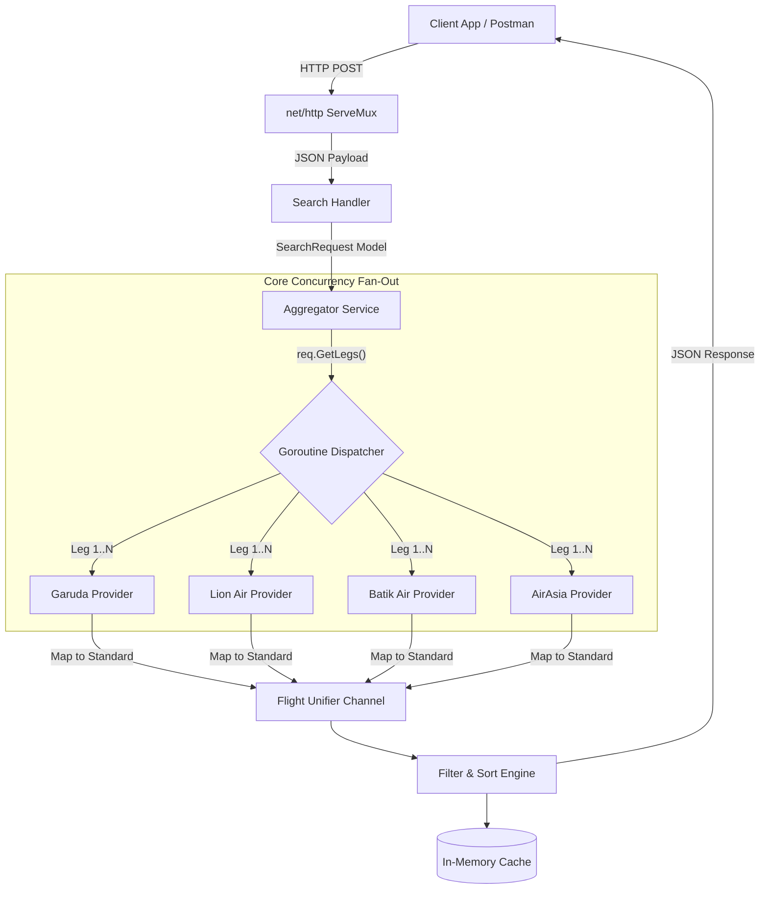
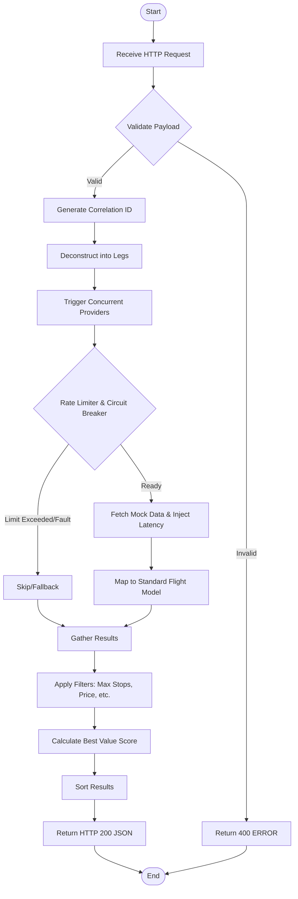
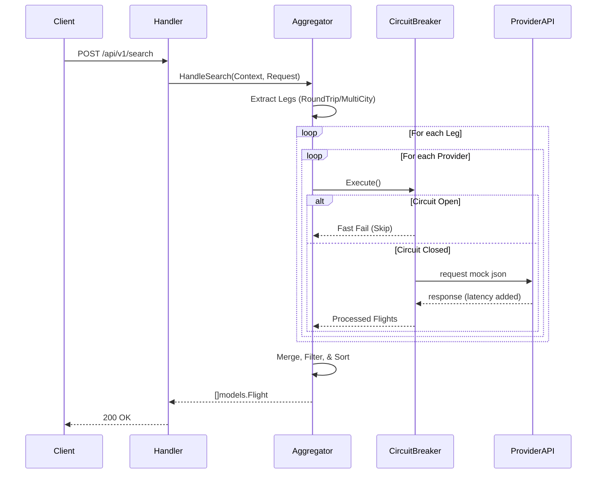
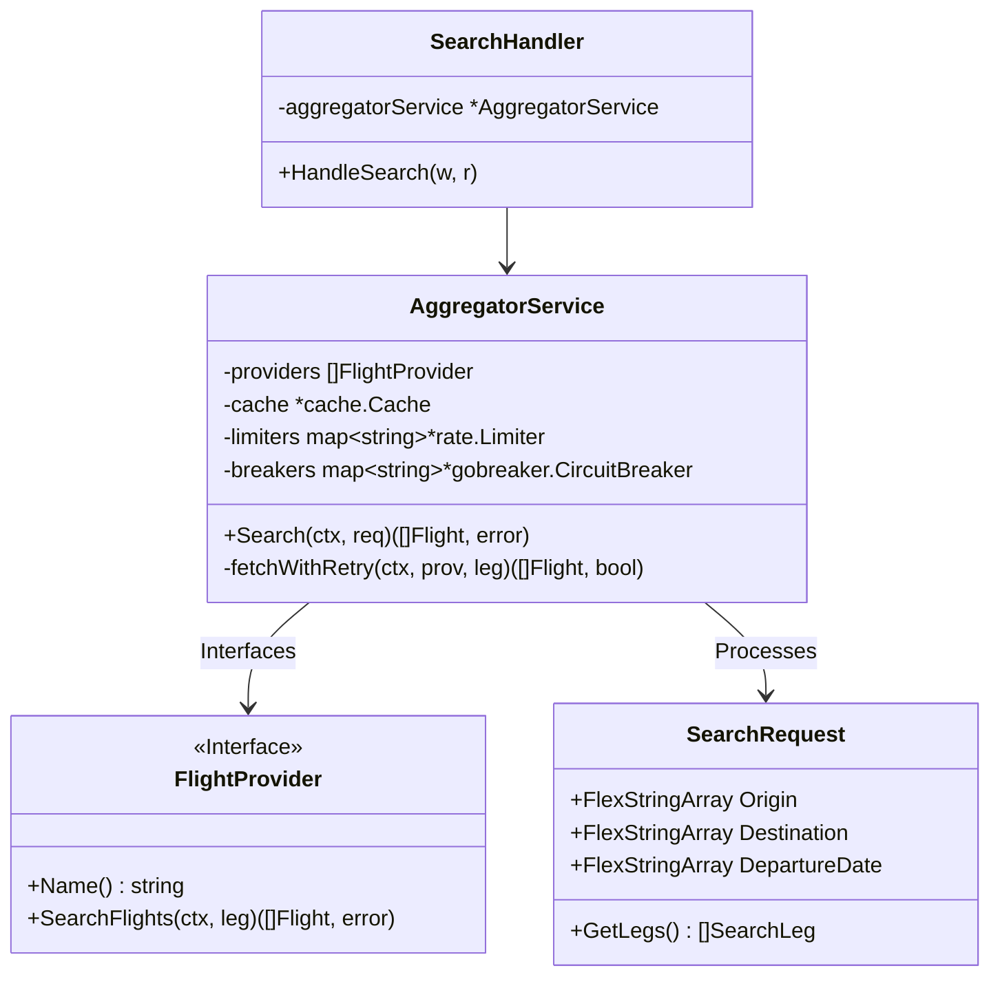
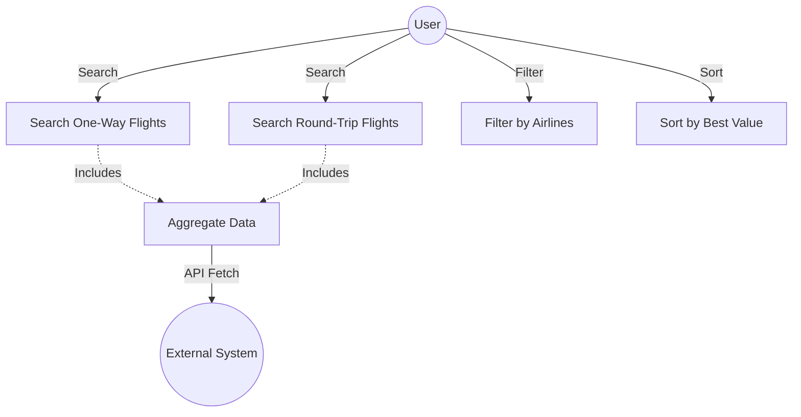

# Heimdall Travel Service - Flight Search & Aggregation System

A concurrent Go service that aggregates flight data from multiple simulated airline APIs, sanitizes and merges the payloads, runs filtering and dynamic sorting rules, and serves them instantly via an in-memory cache. 

This repository successfully implements the core requirements and handles production-ready phenomena like provider API failures, latency fluctuations, missing fields, and timezone disparities.

---

## 1. Setup & Run Instructions

### Prerequisites
* **Go 1.22+** (Developed and tested strictly on Go 1.26.1). No external containers (like Docker or Redis) are required since caching is handled purely in-memory.

### Installation

1. Clone or navigate to the repository folder: 
   ```bash
   git clone https://github.com/pandusatrianura/heimdall-travel-service.git
   cd heimdall-travel-service
   ```
2. Ensure Go modules are tidy:
   ```bash
   go mod tidy
   ```
3. Initialize the environment:
   ```bash
   cp .env.example .env
   ```
4. **Configure your settings**: Edit `.env` to tune your search algorithm (timeouts, ranking weights, etc.).
5. **Install k6 (Optional)**: If you plan to run advanced load tests, follow the [k6 Installation Guide](#5-advanced-performance-testing-k6).

### Running the Server
The application initializes relative mock data streams from the root directory. Start the server from the project's root:

```bash
go run ./cmd/server/main.go
```
*The service will start on port `8008` (default). You can change this in your `.env` file.*

### Environment Configurations (.env)
The system is fully tunable without code changes via the following environment variables:

| Key | Default Value | Description |
| :--- | :--- | :--- |
| `PORT` | `8008` | The HTTP port the service will listen on. |
| `MOCK_DATA_PATH` | `mock_provider` | Directory containing the mock airline response JSON files. |
| `MOCK_DATA_PROVIDER` | `[...]` | JSON list of filenames used for mock responses across all providers. |
| `CACHE_TTL_MINUTES` | `5` | Duration in minutes that search results remain in the memory cache. |
| `CACHE_CLEANUP_MINUTES` | `10` | Interval in minutes for the background process to purge expired cache entries. |
| `PROVIDER_TIMEOUT_MS` | `1500` | Maximum time to wait for a provider response before timing out. |
| `BEST_VALUE_PRICE_WEIGHT` | `0.6` | Weight (0 to 1.0) applied to price in the "Best Value" ranking algorithm. |
| `BEST_VALUE_DURATION_WEIGHT` | `0.4` | Weight (0 to 1.0) applied to flight duration in the ranking algorithm. |
| `AIRASIA_DELAY_MS` | `100` | Simulated network delay (latency) for the AirAsia provider. |
| `AIRASIA_FAILURE_RATE` | `10` | Probability (0-100) of a simulated failure for the AirAsia provider. |
| `BATIK_AIR_DELAY_MS` | `200` | Simulated network delay (latency) for the Batik Air provider. |
| `GARUDA_INDONESIA_DELAY_MS` | `50` | Simulated network delay (latency) for the Garuda Indonesia provider. |
| `LION_AIR_DELAY_MS` | `150` | Simulated network delay (latency) for the Lion Air provider. |


### Deployment & VPS (Docker)
If you are deploying to a VPS, use the included Docker Compose for an instant production-ready setup:

```bash
docker-compose up -d --build
```
This multi-stage build creates a minimal Alpine image (~20MB) and automatically maps your host ports and `.env` settings.

* `make check` - Full local CI suite (Linter, Security, and Unit Tests).
* `make test` - Runs unit tests with `-race` and `-cover`.
* **Load & Stress Testing** - Measure throughput and latency percentiles:
  ```bash
  chmod +x ./scripts/stress_test.sh && ./scripts/stress_test.sh http://localhost:8008 10 100
  ```

---

## 2. API Usage Examples (curl)

### One-Way Search
```bash
curl -X POST http://localhost:8008/api/v1/search \
     -H "Content-Type: application/json" \
     -d '{
       "origins": "CGK",
       "destinations": "DPS",
       "departureDate": "2025-12-15",
       "passengers": 1,
       "cabinClass": "economy"
     }'
```

### Round-Trip Search
Using legacy properties with a `returnDate`:
```bash
curl -X POST http://localhost:8008/api/v1/search \
     -H "Content-Type: application/json" \
     -d '{
       "origins": "CGK",
       "destinations": "DPS",
       "departureDate": "2025-12-15",
       "returnDate": "2025-12-18",
       "passengers": 1
     }'
```

### Deep Matrix Search (Combination Mode)
Discover all possible flight combinations across multiple origins, destinations, and dates in one request:
```bash
# Matrix: 2 Origins x 2 Destinations x 2 Dates = 8 potential outbound legs
# Returns: Matches from every city to every other city on all provided dates
curl -X POST http://localhost:8008/api/v1/search \
     -H "Content-Type: application/json" \
     -d '{
       "origins": ["CGK", "SUB"],
       "destinations": ["DPS", "SIN"],
       "departureDate": ["2025-12-15", "2025-12-20"],
       "returnDate": ["2025-12-25", "2025-12-26"]
     }'
```
*Identity routes (e.g., CGK→CGK) are automatically filtered out.*

---

## 3. Core Requirement Mapping & Validation

This section demonstrates how the Heimdall Travel Service fulfills every core requirement through specific API capabilities.

### 1. Aggregate Flight Data from Multiple Sources
**Requirement**: Fetch and normalize data from multiple airline/provider APIs.
**Validation**:
```bash
# Demonstrates aggregation from Garuda, Lion, Batik, and AirAsia
# Returns normalized UTC timestamps and accurate IDR formatting
curl -X POST http://localhost:8008/api/v1/search \
     -H "Content-Type: application/json" \
     -d '{
       "origins": "CGK",
       "destinations": "DPS",
       "departureDate": "2025-12-15"
     }'
```

### 2. Search & Filter Capabilities
**Requirement**: Search by route/date and filter by price, stops, airlines, and duration.
**Validation**:
```bash
# Filter: Under 3M IDR, Direct flights only, specific airlines, sorted by duration
curl -X POST http://localhost:8008/api/v1/search \
     -H "Content-Type: application/json" \
     -d '{
       "origins": "CGK",
       "destinations": "DPS",
       "departureDate": "2025-12-15",
       "max_price": 3000000,
       "max_stops": 0,
       "airlines": ["Garuda Indonesia", "Batik Air"],
       "sort_by": "duration_shortest"
     }'
```

### 3. Price Comparison & Ranking
**Requirement**: Compare prices, calculate total duration, and rank by "best value".
**Validation**:
```bash
# Ranking based on "Best Value" (mathematical mix of price and speed)
curl -X POST http://localhost:8008/api/v1/search \
     -H "Content-Type: application/json" \
     -d '{
       "origins": "CGK",
       "destinations": "DPS",
       "departureDate": "2025-12-15",
       "sort_by": "best_value"
     }'
```

### 4. Handle Data Inconsistencies
**Requirement**: Handle time zones, missing fields, and validate flight data chronology.
**Validation**:
```bash
# Triggering validation: returnDate must be after last departureDate
curl -X POST http://localhost:8008/api/v1/search \
     -H "Content-Type: application/json" \
     -d '{
       "origins": ["CGK", "DPS"],
       "destinations": ["DPS", "SIN"],
       "departureDate": ["2025-12-15", "2025-12-20"],
       "returnDate": "2025-12-10"
     }'
```
*Note: The timeutil package internally normalizes mixed provider formats (ISO-8601, RFC-1123) into UTC Unix timestamps.*

---

## 4. API Performance & Complexity

### Algorithm Complexity (The Matrix Factor)
The aggregator transitioned from a linear search to an exhaustive **Matrix Search** (Cartesian Product), significantly increasing the breadth of discovery:
- **Search Logic**: $Legs = \{Origins\} \times \{Destinations\} \times \{Dates\}$
- **Fan-Out Complexity**: **$O(O \cdot D \cdot T \cdot P)$**
  > [!NOTE]
  > **Where**:
  > - **O**: Number of distinct **Origins** provided in the request.
  > - **D**: Number of distinct **Destinations** provided in the request.
  > - **T**: Number of distinct **Travel Dates** (both departure and return dates).
  > - **P**: Number of active **Upstream Providers** (Airline APIs) configured.
- **Example**: Searching **2 origins**, **2 destinations**, and **2 dates** (with 2 returns) across **4 providers** triggers $16 \text{ legs} \cdot 4 \text{ providers} = \mathbf{64}$ concurrent upstream requests.

### High-Concurrency Scatter-Gather
- **Network Bound**: Due to parallel Goroutine fan-out, the wall-clock time is governed by $O(\max(T_{provider}))$, effectively the latency of the slowest provider responding.
- **Processing Bound**: $O(F \log F)$ for sorting and unifying $F$ total flight results.
- **Resource Management**: The system uses `sync.WaitGroup` and buffered result channels to prevent memory leaks during massive fan-out events.

### Throughput & Scaling
The system uses the `golang.org/x/time/rate` token-bucket limiter to safely bridge between high-concurrency requests and provider rate limits.
- **RPS Capability**: Limited primarily by memory (result volume) and the `PROVIDER_TIMEOUT_MS` setting.
- **Observability**: Every response includes a `metadata` block with `total_legs`, `providers_queried`, and `search_time_ms` for performance monitoring.

### Latency Benchmarks (Production-Simulation)
Performance captured using k6 stress tests (10-30 VUs) with 200ms simulated provider latency:

| Mode | Search Legs | Upstream Req | Cold Start Latency | Cached Latency (95%) |
| :--- | :--- | :--- | :--- | :--- |
| **Simple Search** | 1 | 4 | ~160ms | < 2ms |
| **Round-Trip** | 2 | 8 | ~230ms | < 2ms |
| **Deep Matrix** | 16 | 64 | ~840ms | < 4ms |

> [!TIP]
> **Scaling Strategy**: The high-concurrency fan-out ensures that even a massive 16-leg search completes in roughly the same time as the slowest single provider call (~800ms total), rather than scaling linearly with leg count.

---

---

## 5. Explanation of Design Choices

### 1. Zero-Heavyweight Frameworks (Standard Library)
To demonstrate deep Go mastery, we use the pure `net/http` package. As of Go 1.22, the native `ServeMux` supports complex routing (e.g., `POST /api/v1/search`), providing a high-performance, dependency-free foundation that is easier to maintain than third-party wrappers like `Gin`.

### 2. Enterprise Circuit Breaker Pattern (`gobreaker`)
The aggregator uses a **Scatter-Gather pattern** via Goroutines and `sync.WaitGroup`. Beyond simple timeouts, we have integrated **Isolated Circuit Breakers** for every provider using the `sony/gobreaker` library. 
* **State Management**: If a provider fails 5 times consecutively, the circuit opens for **30 seconds**.
* **Resilience**: During this time, the system skips the failing provider entirely, protecting the aggregator from "hanging" on dead upstream services and ensuring lowest-possible latency for healthy providers.

### 3. Resilience & Exponential Backoff
Airlines like AirAsia are simulated with a 10% failure rate. Our system handles this gracefully using an internal retry loop with **Exponential Backoff** (50ms → 100ms → 200ms). This significantly improves reliability over unreliable network links while staying within the global request timeout.

### 4. Structured JSON Logging & Observability (`slog`)
We have replaced standard `log.Printf` with Go 1.21's **Structured JSON Logging**. 
* **Automated Correlation**: Every log record (from Handlers to Providers) automatically includes the **UUID v4 Correlation ID** via a custom context handler. 
* **Production Ready**: Logs are in machine-readable JSON format, ready to be ingested into ELK, Datadog, or Grafana Loki. This enables sub-second tracing of any search transaction across all internal layers.

### 5. Graceful Lifecycle Management
Unlike simple scripts, this service implements **Graceful Shutdown**. Upon receiving `SIGINT` or `SIGTERM`, it stops accepting new requests and waits up to **5 seconds** for in-flight searches to finish before closing. This prevents "502 Bad Gateway" errors during container restarts or deployments.

### 6. Tunable Ranking Algorithm ("Best Value")
The `best_value` sort isn't a hardcoded guess. It uses dynamic normalization:
1. It scans results for min/max price and duration boundaries.
2. It calculates a normalized score (0.0 to 1.0) for every flight.
3. It applies business weights (configurable via `.env`) to find the mathematical "Sweet Spot" between cost and speed.

### 7. Timezone Disparity Resolution
Since different airlines return time in varied formats (ISO-8601, RFC-1123, or custom offsets), we use a dedicated `timeutil` parser. This normalizes everything to **UTC Unix Timestamps**, ensuring duration calculations and sorting are mathematically accurate regardless of the flight's origin timezone.

### 8. Multi-Leg Parallel Fan-Out
To natively support complex queries like **Round-Trip** and **Multi-City** combinations, the traditional Search API has been augmented.
* **Flexible Payload**: Clients can optionally supply arrays of locations and dates (`["CGK","DPS"]`), transparently mapped through advanced JSON unmarshalers (maintaining 100% backward compatibility for single-string payloads).
* **Segment Resolving & Concurrency**: The request is mathematically partitioned into distinct flight legs (`SearchLeg`). Using a high-performance `Goroutine` fan-out mechanism, instead of executing requests sequentially, the aggregator multiplexes `NxM` requests asynchronously (`Legs x Providers`) into a single results channel with aggressive sub-second completion times.

### 9. Token-Bucket Rate Limiting (`golang.org/x/time/rate`)
Airline APIs aggressively flag abusive pollers. Beyond the Circuit Breaker which handles failures, we explicitly prevent API bans by enforcing programmatic throttling.
* **Architecture**: Applying the `golang.org/x/time/rate` Limiter natively in front of the CB barrier limits request dispatch velocities dynamically (e.g., maximum burst 10 requests, 10 RPS throttle limit). Wait periods cascade seamlessly into the existing `context.WithTimeout` structure making it extremely scalable.

---

---

## 6. System Visualization Diagrams

### Architectural Diagram


### Flowchart Diagram


### Sequential Diagram


### UML Diagram (Class/Struct)


### Use Case Diagram


---

---

## 7. Advanced Performance Testing (k6)

For high-concurrency validation and bottleneck analysis, we provide a **k6** test suite.

### 1. Step-By-Step k6 Setup

#### macOS (using Homebrew)
```bash
brew install k6
```

#### Linux (Ubuntu/Debian)
```bash
sudo gpg -k
sudo gpg --no-default-keyring --keyring /usr/share/keyrings/k6-archive-keyring.gpg --keyserver hkp://keyserver.ubuntu.com:80 --recv-keys C5AD17C747E3415A3642D57D77C6C491D6AC1D69
echo "deb [signed-by=/usr/share/keyrings/k6-archive-keyring.gpg] https://dl.k6.io/deb stable main" | sudo tee /etc/apt/sources.list.d/k6.list
sudo apt-get update
sudo apt-get install k6
```

#### Windows (using Winget)
```powershell
winget install k6
```

### 2. Running Load Tests

Start the server first, then in a separate terminal:

**Option A: Basic Load Test (10 Users)**
```bash
make k6-load
```

**Option B: Stress Test (50 Users, 2 Minutes)**
```bash
make k6-stress
```

**Option C: Custom Parameter Run**
```bash
k6 run --vus 20 --duration 30s scripts/load_test.js
```

### 3. Interpreting Results
- **`http_req_duration`**: Look at the `p(95)` value. It should stay below your `PROVIDER_TIMEOUT_MS`.
- **`http_req_failed`**: Should be 0.00%. If failures appear, check if the Circuit Breaker has tripped in the server logs.
- **`iterations`**: Total number of successful flight search cycles completed.

---

---

## 8. System Requirements Specification

### 1 System purpose
The Heimdall Travel Service shall provide a high-performance, concurrent flight aggregation API. Its primary purpose is to unify fragmented airline availability data, calculate complex itineraries (round-trip, multi-city), and rank flights by value and speed to serve client applications.

### 2 System scope
The scope encompasses the backend API logic handling HTTP traffic, managing outbound requests to mock airline providers (Garuda, Lion Air, Batik Air, AirAsia), parsing JSON, sanitizing mismatched timezone formats, and returning optimized JSON arrays. It does not include front-end UI components or physical persistent databases.

### 3 System overview
A purely RESTful Go backend leveraging isolated Goroutines to interface with parallel mocked airline domains.

#### 3.1 System context
The system sits strictly between end-user client applications (e.g., mobile apps, Postman) and upstream external airline inventory APIs.

#### 3.2 System functions
- Parse single and multi-city payloads using flexible `FlexStringArray`.
- Scatter-gather flight queries to upstream providers concurrently.
- Protect upstream boundaries using Time-based Rate Limiting and Circuit Breaking.
- Normalize timezones mathematically.
- Sort based on price, stops, duration, and mathematical Best-Value weighting.

#### 3.3 User characteristics
Target users are front-end application engineers or system operators consuming the JSON REST API expecting sub-second routing data.

### 4 Functional requirements
- The system SHALL accept POST requests at `/api/v1/search`.
- The system SHALL extract `SearchLeg` configurations for complex itineraries.
- The system SHALL query all configured providers concurrently per leg.
- The system SHALL filter combinations violating `max_stops`, `max_price`, or `airlines` constraints.
- The system SHALL return valid results encoded in JSON.

### 5 Usability requirements
- The API SHALL use standardized RESTful schemas.
- Payloads SHALL be fully backward-compatible, seamlessly supporting scalar Strings vs JSON Arrays natively.

### 6 Performance requirements
- **Latency**: Aggregate response time shall be bounded by the slowest provider plus a processing overhead of < 10ms.
- **Throughput**: The system shall handle 100+ concurrent search requests per second on standard cloud hardware (2 vCPU / 4GB RAM).
- **Concurrency**: Scatter-gather fan-out shall support up to 50 parallel provider calls per request without excessive thread thrashing.

### 7 System interface requirements
- HTTP/1.1 or HTTP/2 POST over port `8080`.
- Responses SHALL be `application/json`.
- Standard output logs SHALL be formatted in parsable JSON tracking `request_id` Correlation identifiers.

### 8 System operations
The application operates statelessly and initiates via `./cmd/server/main.go`.

#### 8.1 Human system integration requirements
- Operators SHALL control sorting algorithms, timeouts, and delays strictly via `.env` adjustments without touching compiled code.

#### 8.2 Maintainability requirements
- Implementations SHALL avoid external non-standard-library web frameworks to minimize dependency rot.
- Providers SHALL implement the `FlightProvider` interface natively to ensure scalable decoupling.

#### 8.3 Reliability requirements
- The system SHALL circuit-break (open) for 30s after 5 consecutive failures from any provider.
- Providers SHALL internally attempt Exponential Backoff retries natively prior to failing.

#### 8.4 Other quality requirements
- Strict formatting according to Go `fmt`. All endpoints must propagate standard `context.Context` throughout.

### 9 System modes and states
- **Operational Mode**: Normal concurrent fan-out execution.
- **Degraded Mode**: If specific providers are circuit-broken or dead, the system processes degraded mode automatically—returning partial, successful results rather than hanging.

### 10 Physical characteristics
Not applicable as this is a software-only cloud-native application.

#### 10.1 Physical requirements
N/A.

#### 10.2 Adaptability requirements
The system SHALL compile cross-platform via Go natively on Alpine Linux (`docker-compose`).

### 11 Environmental conditions
Deployment environments SHALL dynamically provide local `.env` simulation configs targeting latencies directly.

### 12 System security requirements
- Current implementation assumes internal gateway-level authentication.
- API boundaries SHALL reject malformed bodies defensively.

### 13 Information management requirements
- Transacted searches are cached intelligently up to `CACHE_TTL_MINUTES` cleanly avoiding upstream bandwidth waste.

### 14 Policy and regulation requirements
- Log structures isolate contextual data securely without tracking end-user physical IPs by default.

### 15 System life cycle sustainment requirements
- New flight APIs CAN be instantiated securely by writing a class conforming to the standard `FlightProvider` interface and appending it dynamically to the aggregator logic.

### 16 Packaging, handling, shipping, and transportation requirements
- Codebase packaged as a monolithic Git repository requiring only Go 1.22+ to build successfully.

### 17 Verification
- The pipeline MUST pass Go Unit tests covering filter bounds, models arrays, and retry backoffs natively.
- The `Heimdall_Collection.json` Postman suite VERIFIES dynamic JSON array capabilities fully.

### 18 Assumptions and dependencies
- Upstream Mock providers act predictably similar to live REST applications.
- Server is provisioned with enough local ram (20MB+) for the application binary itself.```