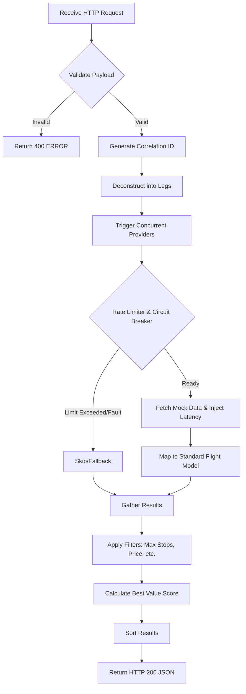
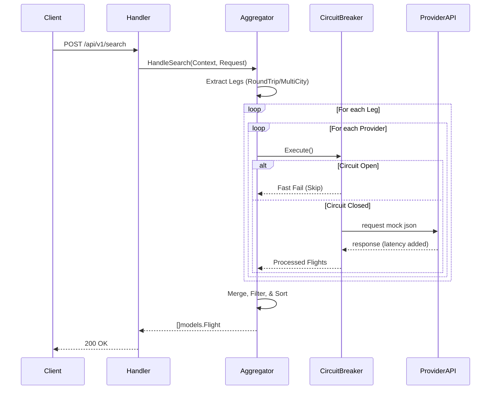
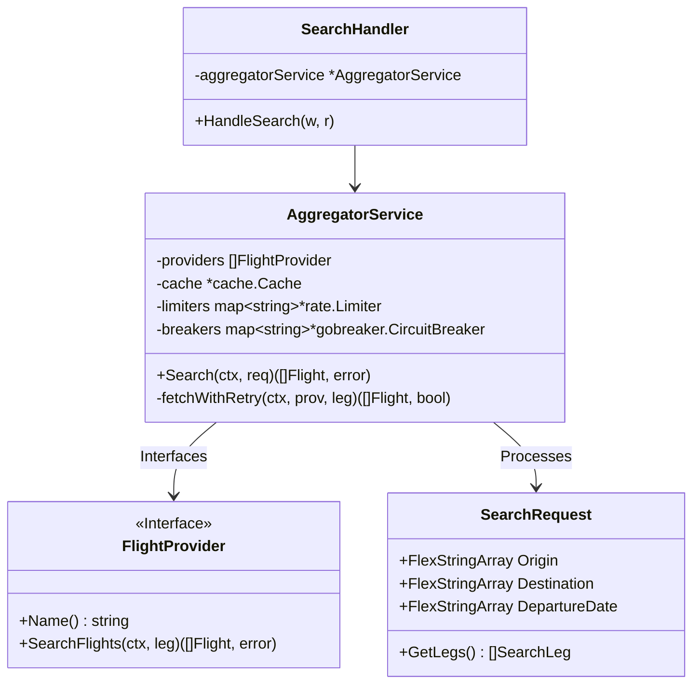

# Heimdall Travel Service - Flight Search & Aggregation System

A concurrent Go service that aggregates flight data from multiple simulated airline APIs, sanitizes and merges the payloads, runs filtering and dynamic sorting rules, and serves them instantly via an in-memory cache. 

This repository successfully implements the core requirements and handles production-ready phenomena like provider API failures, latency fluctuations, missing fields, and timezone disparities.

---

## 1. Setup & Run Instructions

### Prerequisites
* **Go 1.22+** (Developed and tested strictly on Go 1.26.1). No external containers (like Docker or Redis) are required since caching is handled purely in-memory.

### Installation

1. Clone or navigate to the repository folder: 
   ```bash
   git clone https://github.com/pandusatrianura/heimdall-travel-service.git
   cd heimdall-travel-service
   ```
2. Ensure Go modules are tidy:
   ```bash
   go mod tidy
   ```
3. Initialize the environment:
   ```bash
   cp .env.example .env
   ```
4. **Configure your settings**: Edit `.env` to tune your search algorithm (timeouts, ranking weights, etc.).

### Running the Server
The application initializes relative mock data streams from the root directory. Start the server from the project's root:

```bash
go run ./cmd/server/main.go
```
*The service will start on port `8080` (default). You can change this in your `.env` file.*

### Environment Configurations (.env)
The system is fully tunable without code changes via the following environment variables:

| Variable | Default | Description |
| :--- | :--- | :--- |
| `PORT` | `8080` | Port for the HTTP server. |
| `MOCK_DATA_PATH` | `mock_provider` | Path to the mock JSON files. |
| `CACHE_TTL_MINUTES` | `5` | Time To Live for in-memory cache entries. |
| `CACHE_CLEANUP_MINUTES` | `10` | Interval for the cache background cleanup. |
| `PROVIDER_TIMEOUT_MS` | `1500` | Max duration to wait for all airline APIs combined. |
| `BEST_VALUE_PRICE_WEIGHT` | `0.6` | 60% preference towards cheaper flights in the ranking. |
| `BEST_VALUE_DURATION_WEIGHT` | `0.4` | 40% preference towards faster flights in the ranking. |

### Deployment & VPS (Docker)
If you are deploying to a VPS, use the included Docker Compose for an instant production-ready setup:

```bash
docker-compose up -d --build
```
This multi-stage build creates a minimal Alpine image (~20MB) and automatically maps your host ports and `.env` settings.

### CI/CD Developer Tooling
* `make check` - Full local CI suite (Linter, Security, and Unit Tests).
* `make test` - Runs unit tests with `-race` and `-cover`.

---

## 2. Explanation of Design Choices

### 1. Zero-Heavyweight Frameworks (Standard Library)
To demonstrate deep Go mastery, we use the pure `net/http` package. As of Go 1.22, the native `ServeMux` supports complex routing (e.g., `POST /api/v1/search`), providing a high-performance, dependency-free foundation that is easier to maintain than third-party wrappers like `Gin`.

### 2. Enterprise Circuit Breaker Pattern (`gobreaker`)
The aggregator uses a **Scatter-Gather pattern** via Goroutines and `sync.WaitGroup`. Beyond simple timeouts, we have integrated **Isolated Circuit Breakers** for every provider using the `sony/gobreaker` library. 
* **State Management**: If a provider fails 5 times consecutively, the circuit opens for **30 seconds**.
* **Resilience**: During this time, the system skips the failing provider entirely, protecting the aggregator from "hanging" on dead upstream services and ensuring lowest-possible latency for healthy providers.

### 3. Resilience & Exponential Backoff
Airlines like AirAsia are simulated with a 10% failure rate. Our system handles this gracefully using an internal retry loop with **Exponential Backoff** (50ms → 100ms → 200ms). This significantly improves reliability over unreliable network links while staying within the global request timeout.

### 4. Structured JSON Logging & Observability (`slog`)
We have replaced standard `log.Printf` with Go 1.21's **Structured JSON Logging**. 
* **Automated Correlation**: Every log record (from Handlers to Providers) automatically includes the **UUID v4 Correlation ID** via a custom context handler. 
* **Production Ready**: Logs are in machine-readable JSON format, ready to be ingested into ELK, Datadog, or Grafana Loki. This enables sub-second tracing of any search transaction across all internal layers.

### 5. Graceful Lifecycle Management
Unlike simple scripts, this service implements **Graceful Shutdown**. Upon receiving `SIGINT` or `SIGTERM`, it stops accepting new requests and waits up to **5 seconds** for in-flight searches to finish before closing. This prevents "502 Bad Gateway" errors during container restarts or deployments.

### 6. Tunable Ranking Algorithm ("Best Value")
The `best_value` sort isn't a hardcoded guess. It uses dynamic normalization:
1. It scans results for min/max price and duration boundaries.
2. It calculates a normalized score (0.0 to 1.0) for every flight.
3. It applies business weights (configurable via `.env`) to find the mathematical "Sweet Spot" between cost and speed.

### 7. Timezone Disparity Resolution
Since different airlines return time in varied formats (ISO-8601, RFC-1123, or custom offsets), we use a dedicated `timeutil` parser. This normalizes everything to **UTC Unix Timestamps**, ensuring duration calculations and sorting are mathematically accurate regardless of the flight's origin timezone.

### 8. Multi-Leg Parallel Fan-Out
To natively support complex queries like **Round-Trip** and **Multi-City** combinations, the traditional Search API has been augmented.
* **Flexible Payload**: Clients can optionally supply arrays of locations and dates (`["CGK","DPS"]`), transparently mapped through advanced JSON unmarshalers (maintaining 100% backward compatibility for single-string payloads).
* **Segment Resolving & Concurrency**: The request is mathematically partitioned into distinct flight legs (`SearchLeg`). Using a high-performance `Goroutine` fan-out mechanism, instead of executing requests sequentially, the aggregator multiplexes `NxM` requests asynchronously (`Legs x Providers`) into a single results channel with aggressive sub-second completion times.

### 9. Token-Bucket Rate Limiting (`golang.org/x/time/rate`)
Airline APIs aggressively flag abusive pollers. Beyond the Circuit Breaker which handles failures, we explicitly prevent API bans by enforcing programmatic throttling.
* **Architecture**: Applying the `golang.org/x/time/rate` Limiter natively in front of the CB barrier limits request dispatch velocities dynamically (e.g., maximum burst 10 requests, 10 RPS throttle limit). Wait periods cascade seamlessly into the existing `context.WithTimeout` structure making it extremely scalable.

---

## 3. System Visualization Diagrams

### Architectural Diagram
```mermaid
graph TD
    Client[Client App / Postman] -->|HTTP POST| Router[net/http ServeMux]
    Router -->|JSON Payload| Handler[Search Handler]
    Handler -->|SearchRequest Model| Aggregator[Aggregator Service]
    
    subgraph Core Concurrency Fan-Out
        Aggregator -->|req.GetLegs()| Dispatcher{Goroutine Dispatcher}
        Dispatcher -->|Leg 1..N| ProviderA[Garuda Provider]
        Dispatcher -->|Leg 1..N| ProviderB[Lion Air Provider]
        Dispatcher -->|Leg 1..N| ProviderC[Batik Air Provider]
        Dispatcher -->|Leg 1..N| ProviderD[AirAsia Provider]
    end

    ProviderA -->|Map to Standard| Unifier[Flight Unifier Channel]
    ProviderB -->|Map to Standard| Unifier
    ProviderC -->|Map to Standard| Unifier
    ProviderD -->|Map to Standard| Unifier

    Unifier --> FilterSort[Filter & Sort Engine]
    FilterSort --> Cache[(In-Memory Cache)]
    FilterSort -->|JSON Response| Client
```

### Flow Diagram


### Sequential Diagram


### UML Diagram (Class/Struct)


### Use Case Diagram
```mermaid
usecaseDiagram
    actor User
    actor ExternalSystem
    
    User --> (Search One-Way Flights)
    User --> (Search Round-Trip Flights)
    User --> (Filter by Airlines)
    User --> (Sort by Best Value)
    
    (Search One-Way Flights) .> (Aggregate Data) : <<includes>>
    (Aggregate Data) --> ExternalSystem : API Fetch (Simulated)
```